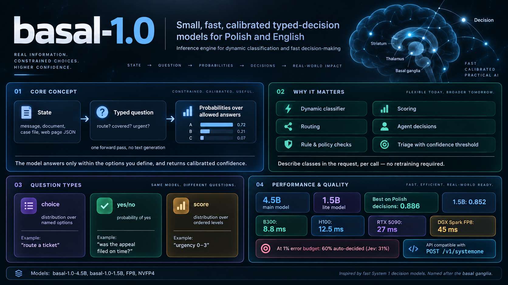

# basal

[](https://huggingface.co/collections/Remek/basal-10-6ab8224bf7bd8732d7a6117d)
[](https://arxiv.org/abs/XXXX.XXXXX)



Inference engine for **basal-1.0** — small, fast, calibrated *typed-decision* models for Polish (and English).

**What it is.** basal-1.0 is inspired by the *System 1* (fast, intuitive) decision models such as Jev: instead of a
chatbot that writes an answer, the model reads a **state** (a message, a document, a case file, a web page as JSON)
and answers a **typed question** about it by returning a **probability for each allowed answer** — in one forward
pass, without generating any text. The answer can therefore never fall outside the options you gave, and the
probability says how sure the model is.

**What it is for: a dynamic classifier.** You describe the classes *in the request* — in plain language, per call —
instead of training a classifier for them. The same model routes tickets today, checks a filing deadline tomorrow and
scores the urgency of an incident report next week, each time with new options and no retraining. This makes it a
drop-in, very fast replacement for:

- ticket, e-mail and document **routing** with categories that change often;
- **rule and policy checks** on a document ("is the claim covered?", "was the appeal filed in time?");
- **scoring** on ordered scales (urgency, risk, satisfaction);
- **agent decisions** (which tool, which next step, which element to click) and **guard checks** in LLM pipelines,
  where a full LLM call is too slow or too expensive;
- **triage with a confidence threshold**: accept confident decisions automatically and send the rest to a person.

**How fast.** One decision (both option orders, calibrated) takes **8.8 ms on a B300, 12.5 ms on an H100, 27 ms on an
RTX 5090 and 45 ms on a desktop DGX Spark (FP8)**; the 1.5B model is about twice as fast. On Polish decisions it is more
accurate than the commercial Jev API and ten open decision models (see [Quality](#quality)).

A question has one of three types:

| type     | answer                                              | example                                   |
|----------|-----------------------------------------------------|-------------------------------------------|
| `choice` | distribution over named options                     | route a ticket, pick the applicable rule  |
| `noul`   | probability of *yes* (with optional descriptions)   | "was the appeal filed on time?"           |
| `score`  | distribution over ordered levels + expected level   | urgency 0–3, sentiment scale              |

The HTTP API is compatible with the *System One* JSON interface (`POST /v1/systemone`), so existing clients work by
changing the base URL.

> The name comes from the *basal ganglia* — the part of the brain that selects one action among competing options.

## Models

| model | params | use | Hugging Face |
|---|---|---|---|
| **basal-1.0-4.5B** | 4.5B | main model, highest quality | `Remek/basal-1.0-4.5B` (bf16, includes early-exit heads) |
| basal-1.0-4.5B-FP8 / -NVFP4 | 4.5B | ModelOpt checkpoints for vLLM (Hopper / Blackwell) | `Remek/basal-1.0-4.5B-FP8`, `Remek/basal-1.0-4.5B-NVFP4` |
| **basal-1.0-1.5B** | 1.5B | *lite*: 2.5× throughput, −2.9 points | `Remek/basal-1.0-1.5B` |
| basal-1.0-1.5B-FP8 / -NVFP4 | 1.5B | ModelOpt checkpoints for vLLM | `Remek/basal-1.0-1.5B-FP8`, `Remek/basal-1.0-1.5B-NVFP4` |

Both models are fine-tuned from Apache-2.0 base models (see [NOTICE](NOTICE)) on Polish and English decision data whose
labels are computed by code, grounded in statutes or checked by independent verifiers, and are calibrated per question
type (temperatures stored in `CALIBRATION.json` and applied by the server).

## Quality

Accuracy, both option orders averaged. *PL decisions*: 7,081 held-out Polish decisions (unseen templates, statutes and
domains); *PL general*: Polish knowledge, exams, reading comprehension; *EN decisions*: 1,479 held-out English
decisions; *Public bench.*: the 231-item public English decision benchmark (official harness). Open systems were served
with their own official servers on one H100.

| system | params | PL decisions | PL general | EN decisions | Public bench. |
|---|---|---|---|---|---|
| **basal-1.0-4.5B** | 4.5B | **0.886** | 0.737 | 0.740 | 0.714 |
| basal-1.0-1.5B | 1.5B | 0.851 | 0.656 | 0.734 | 0.662 |
| Jev 1.13.0 (commercial API) | – | 0.779 | – | 0.736 | 0.861 |
| AutoJev-27B | 27B | 0.776 | **0.833** | **0.753** | 0.870 |
| Cygnet | 12B | 0.686 | 0.793 | 0.703 | **0.879** |
| Jev-Omni | 12B | 0.685 | 0.768 | 0.694 | 0.866 |
| JevK5 v0.2 | 4B | 0.632 | 0.744 | 0.670 | 0.857 |
| Winnow-12B | 12B | 0.686 | 0.772 | 0.703 | 0.853 |
| decider-4b v2 | 4B | 0.708 | 0.717 | 0.694 | 0.835 |
| decider-35B-A3B | 35B (3B active) | 0.691 | 0.781 | 0.751 | 0.831 |
| nimble-9B v2 | 9B | 0.683 | 0.758 | 0.669 | 0.805 |

basal-1.0 is a **Polish specialist**: best on Polish decisions by 11 points, on par with the best systems on English
decisions, and weaker on the general-purpose English benchmark, which it was not trained for. At a 1% error budget it
can decide **60%** of Polish-test decisions automatically (Jev 1.13.0: 31%).

## Speed

One decision = **both option orders** (the default; removes order bias). Batch size 1, median latency; throughput with
32 option-order passes per forward. Offline numbers from `basal-bench`, HTTP numbers from `basal-loadtest`.

| GPU | class | `fast` (bf16) | `fp8` | HTTP `fast` |
|---|---|---|---|---|
| B300 SXM6 | server (Blackwell) | **8.8 ms**, 109 dec/s | 9.7 ms, 102 dec/s | **9.7 ms p50, 109 dec/s** |
| H100 80GB | server | **12.5 ms**, 63 dec/s | 11.3 ms, 80 dec/s | 14.1 ms p50, 63 dec/s |
| RTX PRO 6000 Blackwell | workstation | 18.9 ms, 39 dec/s | 14.9 ms, 58 dec/s | 22.5 ms p50, 39 dec/s |
| RTX 5090 | consumer | 27.3 ms, 24 dec/s | 19.4 ms, 40 dec/s | 32.3 ms p50, 23 dec/s |
| DGX Spark (GB10) | desktop | 92.0 ms, 7 dec/s | **44.6 ms**, 8 dec/s | – |
| basal-1.0-1.5B on B300 | server | **4.7 ms**, 250 dec/s | 5.2 ms, 224 dec/s | – |
| basal-1.0-1.5B on H100 | server | 6.2 ms, 157 dec/s | 6.3 ms, 177 dec/s | 7.7 ms p50, 147 dec/s |
| basal-1.0-1.5B on DGX Spark | desktop | 34.3 ms, 20 dec/s | **18.1 ms**, 31 dec/s | – |

`fast` keeps decisions identical to the fp32 reference (argmax agreement ≥ 0.99); `fp8` changes about 2–3% of
decisions. Which mode is fastest depends on the bottleneck of the card: on the DGX Spark (memory-bandwidth-bound) FP8
halves latency, on workstation and consumer cards it gives 1.3–1.4×, and on the B300 bf16 is already fastest. NVFP4
(4-bit) costs this model about 3 accuracy points and is meant only for batched high-throughput serving (vLLM on the
DGX Spark: 27 instead of 8 decisions/s). See [docs/HARDWARE.md](docs/HARDWARE.md) for every GPU we validated, including B300, A100, RTX 4090 and
DGX Spark (GB10).

## Quick start

```bash
pip install "basal[fp8] @ git+https://github.com/rkinas/basal"     # or: git clone ... && pip install -e ".[fp8]"
huggingface-cli login                                               # the model repos are private for now
basal-serve --model Remek/basal-1.0-4.5B --mode fast --port 8000
```

```bash
curl -s localhost:8000/v1/systemone -H 'content-type: application/json' -d '{
  "state": "Klient: od wczoraj nie mogę zalogować się do bankowości internetowej, system pokazuje błąd hasła.",
  "questions": {"dept": {"type": "choice", "instructions": "Do którego działu skierować zgłoszenie?",
    "criteria": {"cards": "Reklamacje kart", "online": "Wsparcie bankowości elektronicznej", "loans": "Kredyty"}}}}'
```

Response (real output, H100, mode `fast`):

```json
{
 "model": "basal-1.0-4.5B",
 "answers": {
  "dept": {
   "type": "choice",
   "choice": "online",
   "probabilities": {
    "cards": 0.0004,
    "online": 0.9992,
    "loans": 0.0004
   },
   "confidence": 0.9992
  }
 },
 "usage": {
  "input_tokens_approx": 271,
  "output_tokens": 0,
  "questions": 1,
  "latency_ms": 10.49
 }
}
```

Python:

```python
from basal.client import Basal
b = Basal("http://127.0.0.1:8000")
a = b.score("Zgłoszenie z oddziału w Gdańsku: od 7:40 nie działa żaden terminal płatniczy, klienci odchodzą od kas, "
            "kolejka na 30 osób. Obejście: tylko gotówka.",
            "Jak pilne jest to zgłoszenie?",
            ["niska — można zaplanować", "średnia — w ciągu kilku dni", "wysoka — dziś", "krytyczna — natychmiast"])
print(round(a["score"], 2), a["probabilities"])
# real output: 2.71 {"0": 0.005, "1": 0.003, "2": 0.269, "3": 0.722}
# (expected level 2.71 of 0-3: most likely "krytyczna" 0.72, "wysoka" 0.27)
```

## Inference on a JSONL file

`basal-run` sends every line of a JSONL file to a running server (concurrently; the server batches the requests) and
writes one answer per line, in the same order. Start a server first (`basal-serve ...`), then:

```bash
basal-run --input examples/questions.jsonl --output answers.jsonl --url http://127.0.0.1:8000/v1/systemone
```

Each input line is either a **simple item** or a **full request** (the formats can be mixed):

```jsonc
// simple item: one question, options as a list; "type" defaults to "choice", "gold" (index) is optional
{"id": "t1", "state": "Klient: od wczoraj nie mogę zalogować się do bankowości ...", "question": "Do którego działu skierować zgłoszenie?",
 "options": ["Reklamacje kart", "Wsparcie bankowości elektronicznej", "Kredyty"], "gold": 1}
// yes/no item: options are [yes-text, no-text]
{"id": "t2", "type": "noul", "state": "...", "question": "Czy odstąpienie złożono w terminie?", "options": ["Tak", "Nie"]}
// full /v1/systemone request: several typed questions about one state
{"id": "t3", "state": {"ticket": "..."}, "questions": {"category": {"type": "choice", "instructions": "...", "criteria": {"complaint": "...", "other": "..."}},
                                                      "urgent": {"type": "noul", "instructions": "..."}}}
```

Each output line contains `id`, the full `answers` (probabilities, confidence) and the server `latency_ms`; simple items
also get `prediction` (index of the chosen option), `option`, `confidence` and, when `gold` is given, `correct`. At the
end `basal-run` prints a summary (items per second, median latency and accuracy if gold labels are present).
Ready-to-run examples (Polish and English) in `examples/`:

| file | what it shows |
|---|---|
| `choice.jsonl` | routing, document type, amounts, policy rules, sentiment, next step — one option out of 3–4 (with `gold`) |
| `noul.jsonl` | yes/no decisions: deadlines, approval thresholds, phishing, refunds, missing information, alerts (with `gold`) |
| `score.jsonl` | ordered scales: urgency, satisfaction, fraud risk, answer correctness; the answer includes the expected level |
| `complex.jsonl` | full requests: several typed questions about one JSON state (fan-out), a web-agent step with structured options, a deadline decomposed into simple questions, loan triage, a prompt-injection guard |
| `questions.jsonl` | 20 mixed items used by `basal-bench` |

```bash
for f in choice noul score complex; do basal-run --input examples/$f.jsonl --output answers_$f.jsonl; done
```

Add `--early-exit 0.99` when the server runs in `fast-exit` mode.

**What to expect on these files** (basal-1.0-4.5B, `fast`, real run): `choice` 6/8, `noul` 7/8, `score` 6/8 correct.
The mistakes are instructive: the model picks a wrong invoice total (823 zł instead of 738 zł) and a wrong bonus band at 103% of plan, and
misreads "above 5 000 zł net" for an amount of exactly 5 000 zł net — with high confidence. Like other System 1 models,
it is weak at **arithmetic and exact thresholds**. Compute numbers in code and let the model make the typed decision on
top of them; split composite rules into simple questions (`complex.jsonl`, `cx-03`: the model gets the last day and the
filing date right with high confidence, while the direct "was it in time?" question stays uncertain at 0.59). Low
confidence is the signal to route a decision to a person; the thresholds for 1% and 5% error are in `CALIBRATION.json`.

From Python, with the client of a running server:

```python
from basal.client import Basal
import json
b = Basal("http://127.0.0.1:8000")
for line in open("examples/questions.jsonl"):
    q = json.loads(line)
    a = b.choice(q["state"], q["question"], {str(i): o for i, o in enumerate(q["options"])})
    print(a["choice"], round(a["confidence"], 3))
```

## Serving modes

`basal-serve --mode <mode>`:

| mode | what it does | GPUs |
|---|---|---|
| `fast` *(default)* | bf16 + `torch.compile` + CUDA graphs + shared prefix + token-budget batching | any CUDA GPU (sm80+) |
| `fast-nocompile` | same without compilation (start-up in seconds instead of minutes) | any CUDA GPU |
| `fast-exit` | `fast` + trained early-exit heads, exit policy chosen **per request** | any CUDA GPU (4.5B only) |
| `fp8` | `fast` with dynamic FP8 weights + activations (torchao) | Ada, Hopper, Blackwell |
| `nvfp4` | `fast` with NVFP4 weights + activations (torchao, experimental) | Blackwell (B200/B300, RTX 50xx/PRO, GB10) |
| `vllm` | vLLM with the ModelOpt **FP8 / NVFP4** checkpoints (native low-precision kernels) | Hopper / Blackwell |
| `eager` | plain PyTorch reference | any GPU or CPU |

- **Two option orders** (`--orders 2`, default): every question is asked with the options in original and reversed
  order and the probabilities are averaged; with the shared prefix this costs only ~7% more than one order.
- **Early exit** (`--mode fast-exit`): *what it is.* The model has 60 layers, and for many questions the answer is
  already clear before the last one. We trained small **exit heads** (a normalisation layer and a low-rank adapter
  that reuse the model's output head) after layers 30, 35, …, 55. During the forward pass the server checks the exit
  head at each of these points; if the probability of the top option is above a threshold calibrated for that layer,
  the remaining layers are skipped and the answer is taken from the exit head. Thresholds are calibrated so that the
  early answer agrees with the full model on a chosen share of decisions (99.9%, 99.5%, 99% or 98% on calibration
  data). Because the model forms its decision late (around layers 51–53), the saving is modest: **12.2 → 10.5 ms per
  decision on H100 at `0.99` with 99.2% agreement with fp32** (8.8 → 7.7 ms on B300). Each request chooses its level
  with `"early_exit": "0.99"`; `"off"` (default) always uses the final layer, so one server serves both. A batch stops
  only when all its requests are confident. Levels: `off`, `0.999`, `0.995`, `0.99`, `0.98`.
- **FP4 with vLLM**: `pip install "basal[vllm]"`, then
  `basal-serve --model Remek/basal-1.0-4.5B-NVFP4 --mode vllm` (see [docs/QUANTIZATION.md](docs/QUANTIZATION.md)).

Start-up: `fast` compiles and captures CUDA graphs for all input shapes before accepting requests (about 3–5 minutes the
first time, seconds with a warm compile cache). Prompts longer than 3,072 tokens are served with a normal forward pass.

## Benchmark your GPU

Two tools are installed with the package. Both run out of the box on the bundled examples (`examples/questions.jsonl`,
`choice.jsonl`, `noul.jsonl`, `score.jsonl`: 44 Polish and English items with gold answers):

```bash
# offline: latency, throughput and agreement of serving modes (no HTTP); put eager-fp32 first as the reference
basal-bench --model Remek/basal-1.0-4.5B --modes eager-fp32 fast fp8 fast-exit@0.99 --out bench.json

# end to end over HTTP against a running server (basal-serve ...)
basal-loadtest --url http://127.0.0.1:8000/v1/systemone
```

`basal-bench` loads the model once per mode and reports, per mode:

| column | meaning |
|---|---|
| `lat2 ms` | median latency of one decision with **both** option orders at batch size 1 (what the server does by default) |
| `lat1 ms` | the same with one option order |
| `dec/s` | two-order decisions per second when 32 option-order passes are processed together |
| `agree` | share of decisions whose top option equals the first mode's (use `eager-fp32` first) |
| `acc` | accuracy against `gold` |
| `GB` | peak GPU memory |

`basal-loadtest` reports the median and p95 latency of sequential requests and the decisions per second with 32
concurrent clients.

**Your own data.** 44 examples are enough to check that everything works, not for precise numbers: latency depends on
prompt length, and accuracy on 44 items is noisy. For numbers that describe *your* workload, write a JSONL file with a
few hundred items in the same simple format (`{"state": ..., "question": ..., "options": [...], "gold": <index>}`,
`gold` optional) with realistic state lengths, and pass it with `--questions my_items.jsonl` (several files are
allowed). The tables in this README were measured with the same tools on our private 500-item test sample (mean
prompt about 360 tokens), which we do not publish so that it cannot be trained on.

## API

`POST /v1/systemone`

```jsonc
{
  "state": "text or JSON",
  "questions": {
    "<name>": {"type": "choice", "instructions": "...", "criteria": {"<key>": "<description>", ...}},
    "<name>": {"type": "noul",   "instructions": "...", "criteria": {"true": "...", "false": "..."}},   // criteria optional
    "<name>": {"type": "score",  "instructions": "...", "criteria": ["level 0", "level 1", ...]}
  },
  "early_exit": "off" | "0.999" | "0.995" | "0.99" | "0.98"      // optional, --mode fast-exit only
}
```

2–10 options per question. Each answer has `probabilities` (calibrated), `confidence` and the type-specific field
(`choice`, `noul` = P(yes), `score` = expected level + `legend`). `GET /v1/models`, `GET /health`.

**Using the confidence.** Probabilities are calibrated on held-out data; `CALIBRATION.json` in each model repo contains
the confidence thresholds at which the error among accepted decisions stays below 1% and 5% — accept decisions above
the threshold automatically and route the rest to a person.

## Limitations

- Trained and evaluated on generated, grounded or verified decision data; claims about specific real-world document
  collections require validation on your own data.
- Polish world knowledge of a 4.5B model is limited; supply the relevant facts in the state.
- Legal rules change; the model does not know rules introduced after its training.
- Decisions with serious consequences for people should be reviewed by a person.

## License

Apache-2.0. The models are derivatives of Apache-2.0 base models; see [NOTICE](NOTICE).
